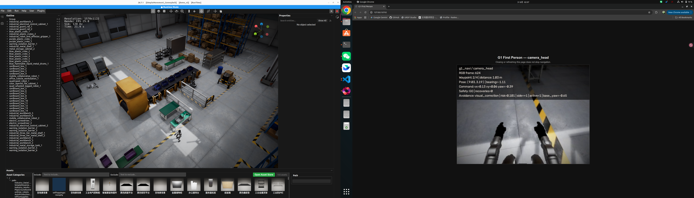
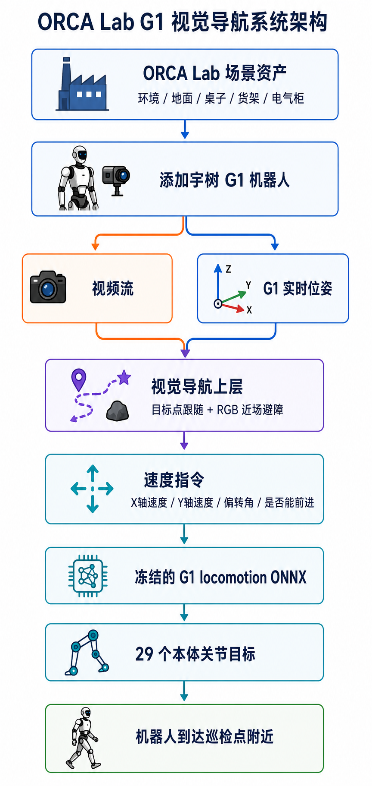
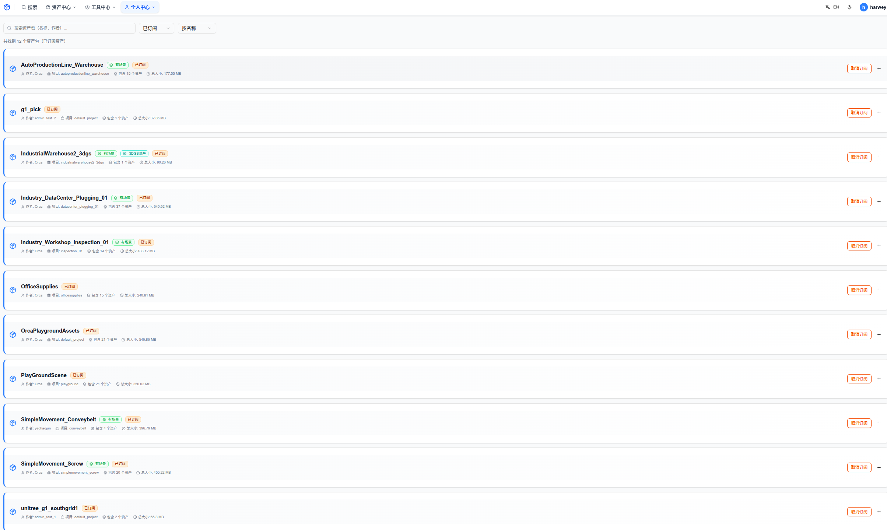
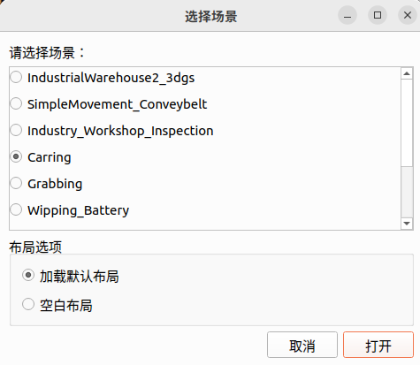
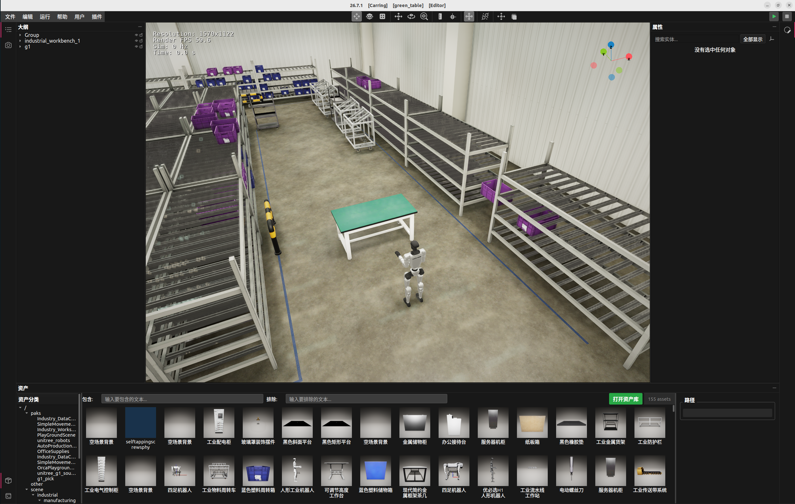
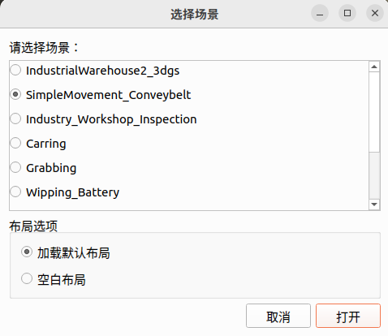
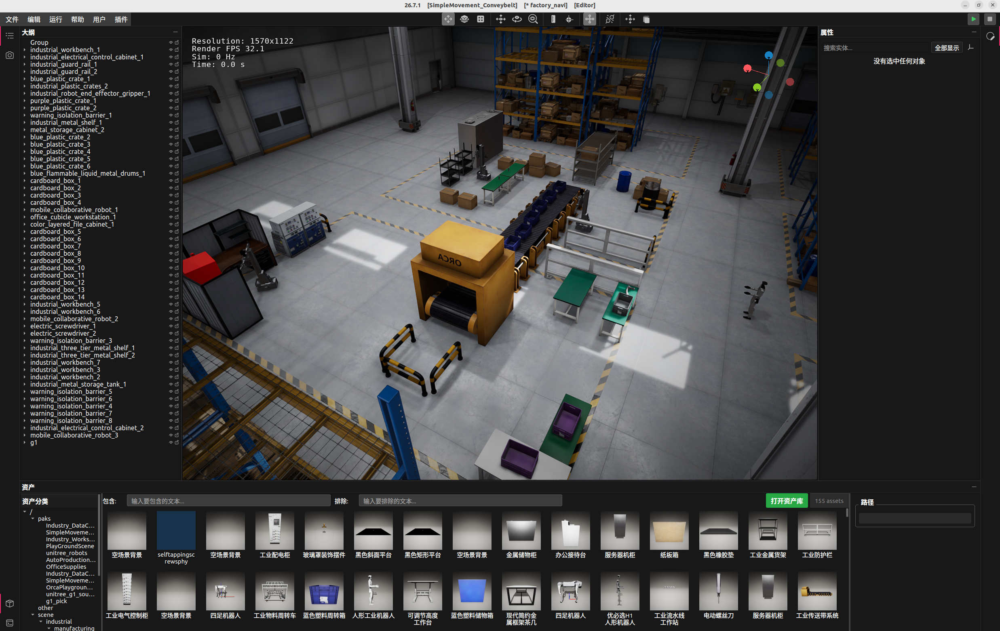
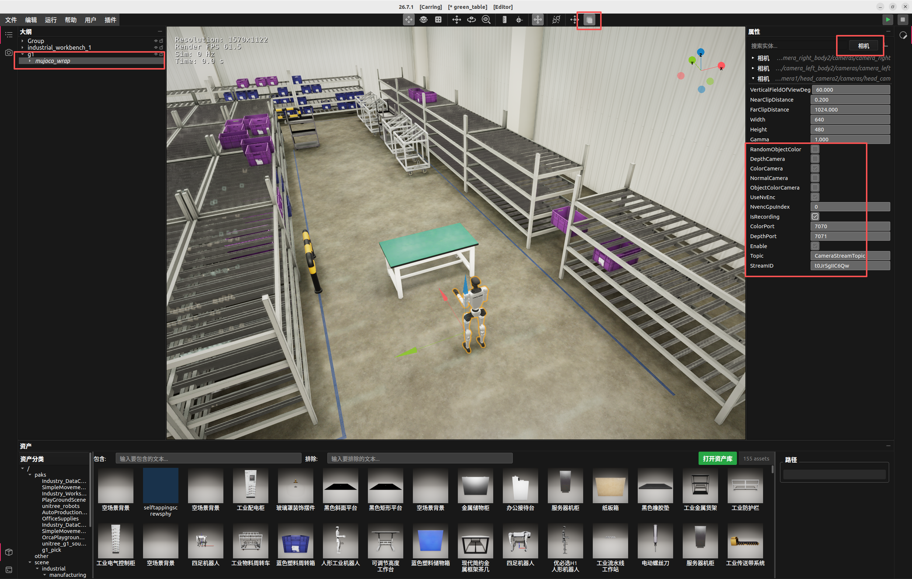
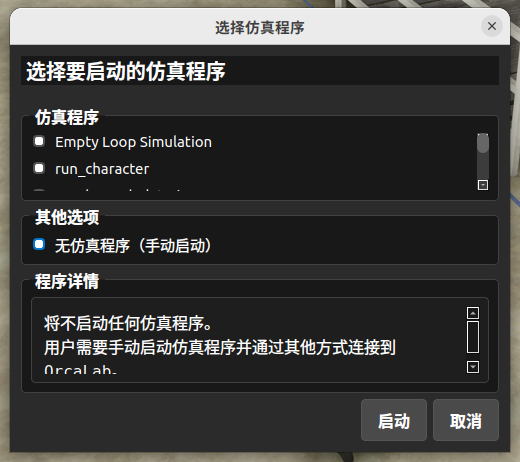
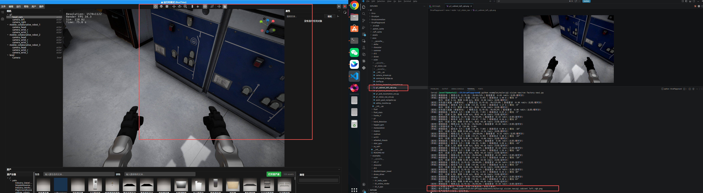

# 松应仿真训练营 · 第二篇：从场景资产搭建到 G1 定点导航

从绿色桌子绕障，到工厂电气柜巡检：用两个循序渐进的 Demo，串起 **场景搭建、相机取流、定点导航、机器人行走与到点拍照**。

本篇复用已有的 G1 ONNX 运控模型，将仿真实时位姿、预设路径点和 RGB 颜色规则组合成导航任务。你将先在简单场景中跑通绕桌闭环，再在工厂场景中完成多路径点的导航到指定位置。



## 资料导航

| 资料 | 入口 |
| --- | --- |
| 第二篇完整技术文档 | [飞书：从场景资产搭建到 G1 定点导航](https://wcnlc0kde55u.feishu.cn/wiki/AnIAwm8ogio7sKkDFQZc1b9Cnef) |
| 第一篇入门教程 | [环境安装、资产与官方示例](https://github.com/Xbotics-Embodied-AI-club/Orcaplayground-G1-routing-inspection/blob/release/26.7.1/docs/tutorial.md) |
| Demo 视频 | [绿色桌子绕障](https://wcnlc0kde55u.feishu.cn/wiki/AnIAwm8ogio7sKkDFQZc1b9Cnef#BZtldaMmwo6pnFxQHhbcHvdpnug) · [工厂电气柜巡检](https://wcnlc0kde55u.feishu.cn/wiki/AnIAwm8ogio7sKkDFQZc1b9Cnef#PW9Rdag28oSvskxsIqtc4eMbnZg) |
| 场景布局文件 | [green_table.json](docs/stage2/layouts/green_table.json) · [factory_navi.json](docs/stage2/layouts/factory_navi.json) |
| 本文操作入口 | [运行准备](#运行准备) · [场景与相机](#场景与相机) · [绕桌前进](#demo-1绿色桌子绕障) · [工厂巡检](#demo-2工厂电气柜巡检) · [FAQ](#常见问题) |
| 官方项目说明 | [OrcaPlayground 官方 README（26.7.1）](https://github.com/openverse-orca/OrcaPlayground/blob/release/26.7.1/README.md) |

视频保留在飞书原文的“仿真视频”章节中；如章节定位未生效，可打开完整文档后定位第四、五章。

## 两个 Demo 与分支

| Demo | 任务 | 分支 | 入口脚本 |
| --- | --- | --- | --- |
| 绿色桌子绕障 | 从桌子南侧出发，识别绿色桌面、绕行并到达北侧目标点 | [feature/demo1-v1-green-table](https://github.com/Xbotics-Embodied-AI-club/Orcaplayground-G1-routing-inspection/tree/feature/demo1-v1-green-table) | `examples/euler/g1_vision_nav/run_green_table_crossing.py` |
| 工厂电气柜巡检 | 沿预设路径点前进，结合 RGB 修正运动，到柜前取景拍照 | [demo1-v1-factory-navi](https://github.com/Xbotics-Embodied-AI-club/Orcaplayground-G1-routing-inspection/tree/demo1-v1-factory-navi) | `examples/euler/g1_vision_nav/run_factory_navi.py` |

两个分支共用这份说明，但各自包含不同的任务入口。运行前先切换到对应分支；不需要把两个分支合并，也不需要下载两份仓库。

## 技术路线

上层导航根据机器人位姿和目标点计算运动方向，再利用相机 RGB 中的颜色信息调整速度与转向。底层 ONNX 模型把速度指令转换为 G1 的 29 个本体关节目标，由执行器适配层驱动场景中的 `g1_pick_usda`。

| 层次 | 输入与职责 |
| --- | --- |
| 场景 | OrcaLab 加载 Layout，提供机器人、桌子、货架和电气柜 |
| 感知与状态 | 通过 gRPC 读取实时位姿，通过 RGB 视频流获取头部相机画面 |
| 导航 | 目标点跟随、路径点切换、基于颜色规则的近场避障 |
| 运控 | 复用已训练的 ONNX 模型，执行前进、侧移与转向指令 |
| 任务结果 | 绕过桌子到达目标，或抵达柜前并保存照片 |

<details>
<summary>展开查看分层架构图</summary>



图中“偏转角”对应的实际控制量是转向角速度 `yaw_rate`。导航层输出速度指令，底层运控模型负责关节动作。

</details>

本案例面向仿真开发入门：位置来自仿真平台，路径点由人工设定，避障和柜前拍照采用颜色规则。它不包含 SLAM、通用目标识别或设备故障诊断；“到点拍照”是模拟巡检流程的一环。

## 运行准备

### 1. 获取课程代码

```bash
mkdir -p ~/SY
cd ~/SY
git clone --branch feature/demo1-v1-green-table \
  https://github.com/Xbotics-Embodied-AI-club/Orcaplayground-G1-routing-inspection.git OrcaPlayground
cd OrcaPlayground
```

这里将本地目录命名为 `OrcaPlayground`，以便与后续命令一致。已有本仓库的用户无需重新克隆。

### 2. 准备开发环境

课程使用 **Ubuntu / Linux、Python 3.12、OrcaLab 26.7.1 和 OrcaGym 26.7.1**。先按[第一篇教程](https://github.com/Xbotics-Embodied-AI-club/Orcaplayground-G1-routing-inspection/blob/release/26.7.1/docs/tutorial.md)完成 OrcaLab 安装。

将图形界面和任务程序分别放在两个 Conda 环境中：`orcalab` 启动图形界面，`orca` 运行 Demo的任务程序。若已配置 `orca`，直接激活；否则从已安装 OrcaLab 的环境复制：

```bash
conda create --name orca --clone orcalab
conda activate orca

cd ~/SY/OrcaPlayground
python -m pip install -r requirements.txt
python -m pip install onnxruntime opencv-python Pillow av websockets

python -m pip show orca-gym
python -c "import sys; print(sys.executable)"
```

确认 OrcaGym 版本及 Python 路径，运行脚本时使用 `orca` 环境。此处复用已有运控模型，不需要安装完整强化学习训练环境，也不要求单独克隆 OrcaGym 源码。

### 3. 准备 Layout 文件

仓库内路径如下：

```text
OrcaPlayground/
└── docs/stage2/layouts/
    ├── green_table.json
    └── factory_navi.json
```

可直接在 OrcaLab 中打开这里的文件，并按下方命令传入 `--layout`。该参数**仅打印场景路径提示，不会替你加载布局**；当前实际场景由 OrcaLab 界面中打开的 Layout 决定，详细解释可以参考文档内置的教学视频。


## 场景与相机

<a id="-手动拖动资产运行前必做"></a>

### 1. 订阅并同步资产

在 [ORCA 资产中心](https://simassets.orca3d.cn/?lang=zh)订阅飞书教程使用的资产包，并等待 OrcaLab 同步完成。Layout 只描述布局，不能代替对应的资产文件。

| 资产包 | 教程中的用途 |
| --- | --- |
| `g1_pick` | 本次使用的 G1 机器人 |
| `AutoProductionLine_Warehouse` | 工作台、周转箱等仓储资产 |
| `Industry_DataCenter_Plugging_01` | 办公桌、电气柜等资产 |
| `Industry_Workshop_Inspection_01` | 工业电气控制柜等资产 |
| `OfficeSupplies` | 绿色办公桌、货柜等资产 |
| `SimpleMovement_Conveybelt` | 传送带场景、金属桶与纸箱 |
| `SimpleMovement_Screw` | 螺丝刀、储物箱等资产 |
| `OrcaPlaygroundAssets` | 官方示例配套资产 |
| `PlayGroundScene` | 示例场景与机器人资产 |
| `unitree_robots` | 宇树机器人资产 |
| `unitree_g1_southgrid1` | 南方电网赛事配套资产 |

<details>
<summary>查看教程中的资产订阅截图</summary>



</details>

### 2. 打开对应场景

终端 A 启动界面：

```bash
conda activate orcalab
cd ~/SY/OrcaPlayground
orcalab .
```

| Demo | 初始场景 | 加载步骤 |
| --- | --- | --- |
| 绿色桌子 | `Carring` | 加载默认布局后，通过“文件 → 打开布局”选择 `docs/stage2/layouts/green_table.json` |
| 工厂巡检 | `SimpleMovement_Conveybelt` | 加载默认布局后，通过“文件 → 打开布局”选择 `docs/stage2/layouts/factory_navi.json` |

<details>
<summary>查看场景选择与 Layout 效果</summary>

**绿色桌子**





**工厂巡检**





</details>

确认场景中已有 `g1` Actor，使用 `g1_pick_usda` 资产。本篇直接控制 Layout 中的机器人，无需额外添加第二台；这与第一篇使用的 G1 资产不同。

### 3. 开启头部 RGB 相机

展开大纲中的 **g1 → mujoco_wrap**，打开“递归显示”，在属性面板中找到头部相机：

- 勾选 `ColorCamera`、`Enable`、`UseNvEnc` 和 `IsRecording`。
- 确认 `ColorPort` 为 `7070`，不要让其他相机占用同一端口。
- 本篇使用 RGB，脚本不依赖深度流。



### 4. 进入手动启动模式

点击右上角三角形启动图标，选择 **“无仿真程序（手动启动）”**，点击启动，确认界面进入 Runtime。



保持终端 A 和 OrcaLab 窗口运行，在终端 B 启动下方的任务脚本。不要同时运行 Empty Loop Simulation 或另一份控制程序。

| 通道 | 默认端口 | 作用 |
| --- | --- | --- |
| gRPC | `50051` | 仿真状态与控制 |
| RGB 视频流 | `7070` | 头部相机彩色图像 |
| 工厂网页预览 | `8765` | 可选的第一视角展示，不是相机取流端口 |

## Demo 1：绿色桌子绕障

**目标：**G1 从绿色桌子南侧出发，利用实时位姿朝北侧目标点前进，并根据 RGB 颜色信息绕过桌子。

在终端 B 中执行：

```bash
cd ~/SY/OrcaPlayground
conda activate orca
git switch feature/demo1-v1-green-table

python examples/euler/g1_vision_nav/run_green_table_crossing.py \
  --layout docs/stage2/layouts/green_table.json
```

[观看绿色桌子 Demo 视频](https://wcnlc0kde55u.feishu.cn/wiki/AnIAwm8ogio7sKkDFQZc1b9Cnef#BZtldaMmwo6pnFxQHhbcHvdpnug) · [查看该分支入口代码](https://github.com/Xbotics-Embodied-AI-club/Orcaplayground-G1-routing-inspection/blob/feature/demo1-v1-green-table/examples/euler/g1_vision_nav/run_green_table_crossing.py)

运行时观察：头部 RGB 能持续取帧，绿色桌子进入视野后导航发生绕行，机器人最终到达目标附近。默认目标坐标为 `(4.7, 0.0)`，可通过 `--goal-x`、`--goal-y` 调整。

该入口默认执行 `4000` 个控制步，不会因到点而立即退出进程；需要提前结束时可按 `Ctrl+C`。
## Demo 2：工厂电气柜巡检

**目标：**沿预设路径点前进，利用 RGB 颜色规则修正运动方向，抵达电气柜附近后取景并保存照片。

先停止上一份 Demo，重新打开 OrcaLab 并选择工厂场景及 `factory_navi.json`，检查头部相机，再进入手动启动模式。终端 B 执行：

```bash
cd ~/SY/OrcaPlayground
conda activate orca
git switch demo1-v1-factory-navi

python examples/euler/g1_vision_nav/run_factory_navi.py \
  --layout docs/stage2/layouts/factory_navi.json
```

[观看工厂巡检 Demo 视频](https://wcnlc0kde55u.feishu.cn/wiki/AnIAwm8ogio7sKkDFQZc1b9Cnef#PW9Rdag28oSvskxsIqtc4eMbnZg) · [查看该分支入口代码](https://github.com/Xbotics-Embodied-AI-club/Orcaplayground-G1-routing-inspection/blob/demo1-v1-factory-navi/examples/euler/g1_vision_nav/run_factory_navi.py)

默认使用左侧路线。第一视角预览默认提供在仿真程序所在机器的 `http://127.0.0.1:8765`，不会自动打开浏览器；不打开网页不影响导航。加入 `--no-camera-window` 可关闭网页服务，RGB 接收和拍照仍会继续。

默认照片路径：

```text
envs/euler/g1_vision_nav/g1_cabinet_left_rgb.png
```



程序按到点状态和蓝色柜体规则进行取景与拍照，没有接入 YOLO。请以本次日志中的“电气柜照片已保存，巡检完成”和文件修改时间确认结果，不能仅凭目录里存在旧照片判断成功。拍照后机器人切换为站立，进程继续到设定控制步数结束。


### 常用参数

| 参数 | 适用 Demo | 说明 |
| --- | --- | --- |
| `--addr` | 两者 | gRPC 地址，默认 `127.0.0.1:50051` |
| `--actor-name` | 两者 | 场景 Actor 名称，默认 `g1` |
| `--rgb-port` | 两者 | 头部 RGB 端口，默认 `7070` |
| `--layout` | 两者 | 当前布局文件的提示路径，不负责加载布局 |
| `--num-steps` | 两者 | 控制步数；绿色桌子默认 `4000`，工厂默认 `8000` |
| `--output` | 两者 | RGB 样本或巡检照片输出路径 |
| `--max-speed` | 工厂 | 巡航速度上限；默认 `1.2` m/s，需按实际场景验证，可用 `0.6` 降速复现 |
| `--no-camera-window` | 工厂 | 关闭网页预览服务 |

完整参数见对应入口的 `--help`。文档中的录屏展示已有运行效果；当前场景、相机设置和代码版本的完成情况仍应以实际运行结果为准。

## 常见问题

| 现象 | 排查方向 |
| --- | --- |
| 找不到入口脚本 | 用 `git branch --show-current` 确认分支；两个入口分别位于两个分支 |
| 场景空白或缺失资产 | 检查资产订阅与同步，确认选择了对应初始场景并打开正确 Layout |
| 无法连接 `50051` | 确认 OrcaLab 已进入 Runtime；远程运行时设置正确的 `--addr` |
| 一直等待 RGB | 检查头部相机开关、`IsRecording`、`ColorPort=7070`，查看相机接流日志 |
| 找不到关节或执行器 | 确认使用 `g1_pick_usda`，Actor 名为 `g1`，不要用第一篇的其他 G1 资产替代 |
| 机器人动作异常、画面跳动 | 检查是否同时开启了多个仿真推进程序；使用手动启动模式，只保留一个 Demo |
| RGB 正常但未绕障 | 检查图像是否持续更新、障碍物颜色是否进入视野；颜色规则不能识别所有障碍 |
| 到柜前但没有新照片 | 查看本次巡检日志、相机画面及文件修改时间；取景未确认时不会报告拍照成功 |

## 继续探索

完成复现后，可以先调整桌子位置、路径点或速度，每次只改变一个因素并观察结果。之后再尝试深度感知、自动路径规划、目标检测。

课程选用 G1，是因为本次资产配置提供相机与可复用运控模型，便于学习完整开发流程，并不代表人形机器人适合所有巡检任务。实际任务仍需依据场景与需求选择机器人和算法。

## 官方资料与致谢

- [第二篇飞书技术文档](https://wcnlc0kde55u.feishu.cn/wiki/AnIAwm8ogio7sKkDFQZc1b9Cnef)
- [第一篇入门资料（release/26.7.1）](https://github.com/Xbotics-Embodied-AI-club/Orcaplayground-G1-routing-inspection/tree/release/26.7.1)
- [OrcaPlayground 官方 README](https://github.com/openverse-orca/OrcaPlayground/blob/release/26.7.1/README.md)
- [OrcaGym](https://github.com/openverse-orca/OrcaGym) · [ORCA 官方文档](https://docs.orca3d.cn/) · [ORCA 资产中心](https://simassets.orca3d.cn/)

本项目基于 OrcaPlayground 和 OrcaGym。感谢上游项目及贡献者，许可证见 [LICENSE](LICENSE)。
